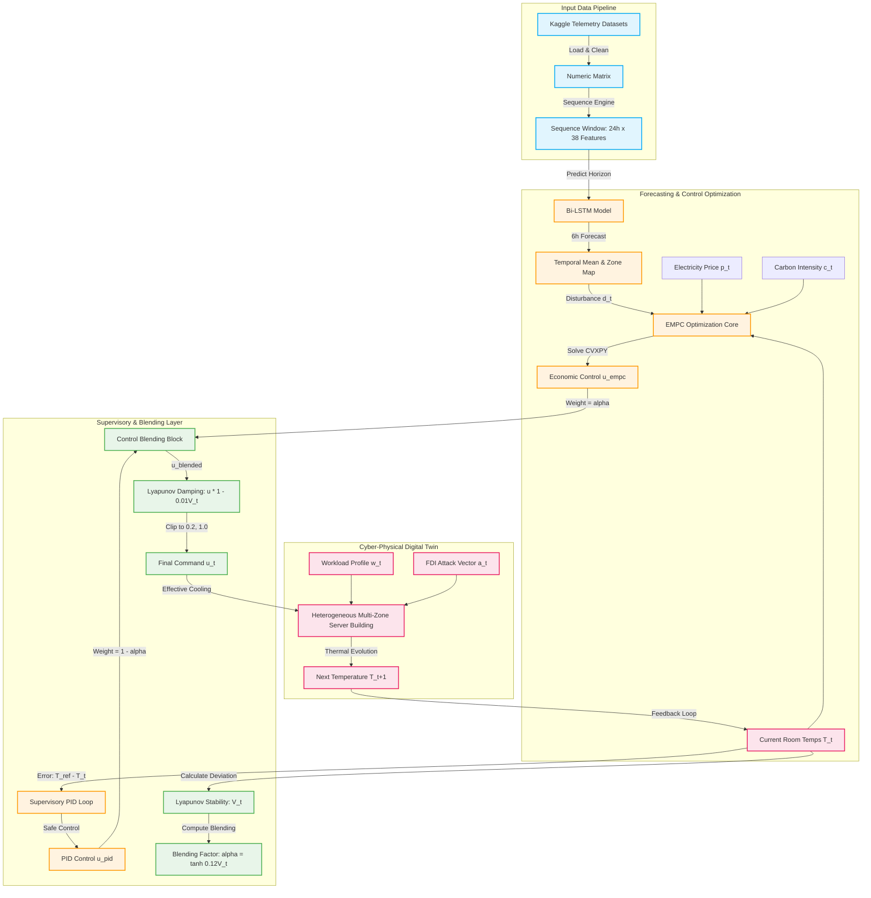
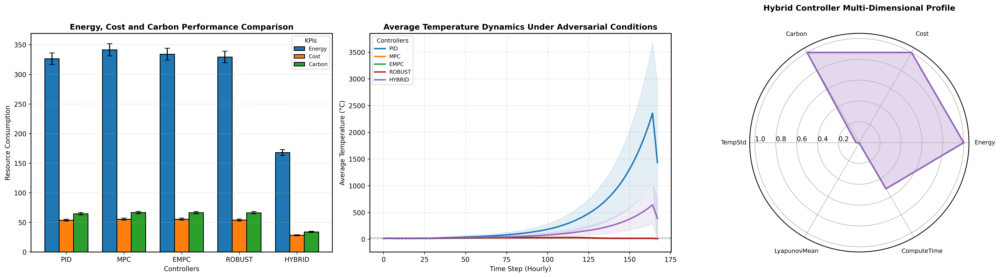
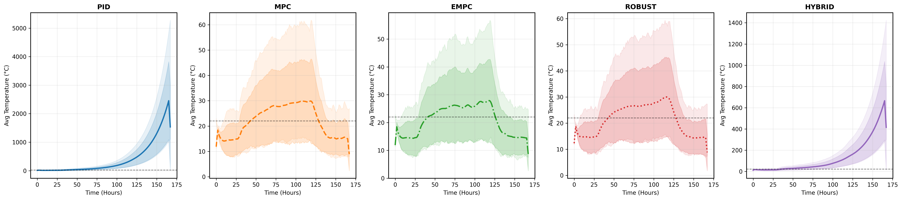
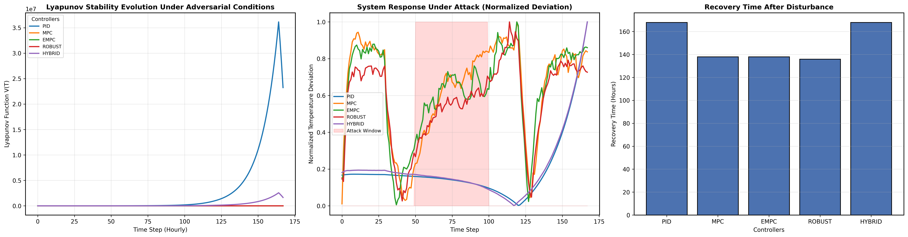
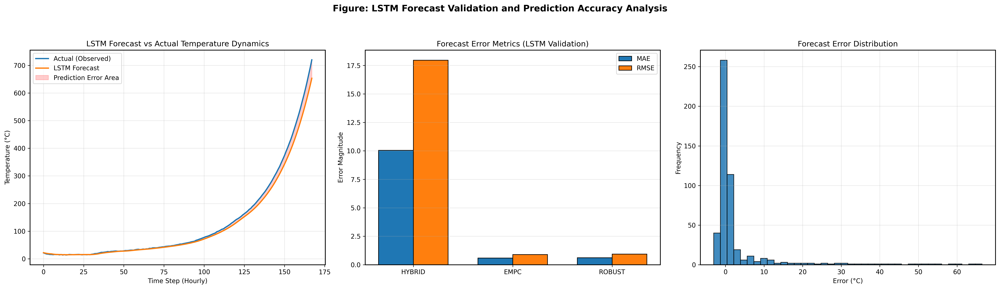
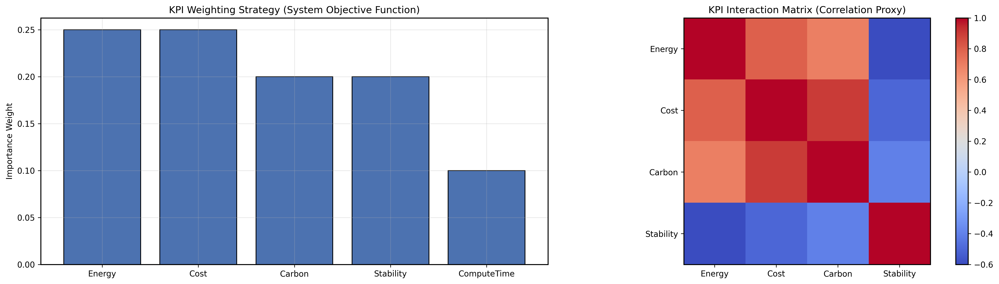

# Data Center Cooling Benchmarks: Evaluation and Comparison of Intelligent Control Architectures

[](https://colab.research.google.com/github/imamdoula004/Data-Center-Cooling-Benchmarks/blob/main/Data_Center_Cooling_Benchmarks.ipynb)
[](LICENSE)

Official benchmarking code and digital twin simulation environment for the IEEE research manuscript:

**"AI-Enhanced Data Driven Hybrid Economic Model Predictive Control with LSTM Forecasting and PID Supervision for Secure, Cost and Carbon Optimal Data Center Cooling."**

---

## 📖 Project Overview

Modern data centers consume massive amounts of electricity, with cooling systems alone accounting for up to **40% of total facility energy usage**. Traditional controllers (e.g., classical PID loops) operate reactively using short-term local feedback. They suffer from **operational myopia**, meaning they cannot anticipate upcoming thermal workloads, dynamic electricity grid tariffs, or fluctuating carbon intensity signals. Furthermore, under cyber-physical **False Data Injection (FDI)** attacks, reactive controllers are prone to closed-loop instability, leading to server damage or extreme cooling overhead.

This repository provides a comprehensive **digital twin benchmarking suite** designed to evaluate, validate, and compare advanced control strategies for data center cooling under normal and adversarial conditions. The environment models a coupled multi-zone facility subjected to dynamic workloads, grid volatility, hardware failures, and cyber-physical FDI attacks.



---

## 🎛 Control Architectures Evaluated

The suite compares five control strategies representing different paradigms in industrial automation:

### 1. Proportional-Integral-Derivative (PID) Control
A classical feedback controller acting as the industrial baseline. While simple, it struggles under highly dynamic workloads and exhibits severe instability under adversarial attacks due to its lack of predictive capability.
* **Formulation:**
  $$e_{z, t} = T_{\text{ref}} - T_{z, t}$$
  $$I_{z, t} = 0.90 \cdot I_{z, t-1} + e_{z, t}$$
  $$D_{z, t} = e_{z, t} - e_{z, t-1}$$
  $$u_{z, t}^{\text{pid}} = K_p e_{z, t} + K_i I_{z, t} + K_d D_{z, t}$$
  $$u_{z, t} = \text{clip}(0.3 \cdot u_{z, t}^{\text{pid}}, 0.2, 1.0)$$
  where $K_p = 0.95$, $K_i = 0.015$, $K_d = 0.05$.

### 2. Model Predictive Control (MPC)
A predictive controller focused entirely on thermal tracking. It minimizes room temperature deviation from the comfort zone reference while penalizing large actuator movements.
* **Objective:**
  $$\min_{u_t \in [0.2, 1.0]^5} \sum_{z=1}^{5} (T_{z, t+1} - T_{\text{ref}})^2 + 0.6 \sum_{z=1}^{5} u_{z, t}^2$$
  $$\text{subject to: } T_{z, t+1} = 0.87 T_{z, t} - 1.25 u_{z, t}$$

### 3. Economic Model Predictive Control (EMPC)
An optimization-based controller that expands the objective function to incorporate time-varying grid electricity pricing and carbon intensity. It directly minimizes operating costs and carbon emissions while maintaining temperature bounds.
* **Objective:**
  $$\min_{u_t \in [0.2, 1.0]^5} \sum_{z=1}^{5} \left( p_{z, t} |u_{z, t}| + 1.2 \cdot c_{z, t} |u_{z, t}| + 4500 (T_{z, t+1} - T_{\text{ref}})^2 + 0.5 u_{z, t}^2 \right)$$
  $$\text{subject to: } T_{z, t+1} = 0.87 T_{z, t} - 1.25 u_{z, t} + d_{z, t}$$
  where $p_{z, t}$ is the electricity price, $c_{z, t}$ is the carbon intensity, and $d_{z, t}$ is the predicted zone disturbance.

### 4. Robust Economic MPC (ROBUST)
A security-hardened formulation of the EMPC that adjusts its actuator constraints dynamically and increases its regularization penalty based on estimated cyber-physical risk, protecting the facility from unstable control inputs.
* **Objective:**
  $$\min_{u_t \in [0.2, u_{t, \text{max}}]^5} \sum_{z=1}^{5} \left( p_{z, t} |u_{z, t}| + 1.5 \cdot c_{z, t} |u_{z, t}| + (1.0 + 0.7 \cdot \text{risk}_t) u_{z, t}^2 + 5000 (T_{z, t+1} - T_{\text{ref}})^2 \right)$$
  $$\text{where: } \text{risk}_t = \| d_t \|_2 \quad \text{and} \quad u_{z, \text{max}} = \text{clip}(1.0 - 0.1 \cdot \text{risk}_t, 0.2, 1.0)$$
  $$\text{subject to: } T_{z, t+1} = 0.87 T_{z, t} - 1.25 u_{z, t} + d_{z, t}$$

### 5. Hybrid EMPC-PID with Bi-LSTM (HYBRID)
Our proposed architecture. It integrates a **3-layer Bidirectional LSTM network** for receding-horizon disturbance forecasting, a tri-objective EMPC optimization core, and a Lyapunov-guided supervisory layer that blends the optimization output with a safe feedback PID loop.
* **Formulation:**
  - Forecasts disturbance vector $d_t = \text{forecast\_disturbance}(X_t)$ via the Bi-LSTM model.
  - Computes optimal EMPC command $u_t^{\text{empc}}$ and PID fallback $u_{z, t}^{\text{pid\_hybrid}} = 0.35 e_{z, t} + 0.02 I_{z, t}^{\text{hybrid}}$ (where $I_{z, t}^{\text{hybrid}} = 0.92 I_{z, t-1}^{\text{hybrid}} + e_{z, t}$).
  - Evaluates Lyapunov stability energy:
    $$V(t) = \sum_{z=1}^{5} (T_{z, t} - T_{\text{ref}})^2$$
  - Blends inputs using a dynamic blending factor $\alpha_t$:
    $$\alpha_t = \tanh(0.12 \cdot V(t))$$
    $$u_{z, t}^{\text{blended}} = \alpha_t u_{z, t}^{\text{empc}} + (1 - \alpha_t) u_{z, t}^{\text{pid\_hybrid}}$$
  - Applies Lyapunov stability damping:
    $$u_{z, t}^{\text{damped}} = u_{z, t}^{\text{blended}} \cdot (1 - 0.01 \cdot V(t))$$
  - Clips the damped output to $u_{z, t} \in [0.2, 1.0]$.

---

## 🧮 Digital Twin Physics & Cyber-Physical Attack Model

### 1. Heterogeneous Multi-Zone Thermal Dynamics
The data center is modeled as a 5-zone coupled thermal environment. The temperature evolution of each server zone $z \in \{1,\dots,5\}$ is modeled by the state-space equation:
$$T_{z, t+1} = 0.86 T_{z, t} - 1.40 (u_{z, t} \cdot \eta_z \cdot m_{z, t}) + 1.25 (w_{z, t} \cdot \theta_z) + a_{z, t} \cdot \lambda_z + \epsilon_{z, t}$$
where:
- $T_{z, t}$: Current temperature of zone $z$ at step $t$ (initial state: $24.5^\circ\text{C}$).
- $u_{z, t}$: Actuator command (chilled air flow rate).
- $\eta_z$: Hardware cooling efficiency coefficients: $[1.35, 1.00, 0.65, 0.90, 1.50]$.
- $m_{z, t} \in \{0, 1\}$: Dynamic hardware degradation mask, modeled as a Bernoulli random variable with failure probabilities $[0.02, 0.05, 0.10, 0.04, 0.03]$ per zone.
- $w_{z, t}$: Computational workload generated in zone $z$: $w_{z, t} \sim \mathcal{U}(0.2, 0.85)$.
- $\theta_z$: Hardware thermal inertia factors: $[1.20, 1.00, 1.80, 1.10, 1.40]$.
- $a_{z, t}$: False Data Injection (FDI) cyber-physical attack signal.
- $\lambda_z$: Hardware susceptibility/latency factors to attacks: $[0.20, 0.55, 0.95, 0.45, 0.25]$.
- $\epsilon_{z, t} \sim \mathcal{N}(0, 0.025^2)$: Gaussian ambient thermal noise.

### 2. Cyber-Physical False Data Injection (FDI) Attack Model
To validate security under adversarial conditions, a persistent threat actor hijacks sensor telemetry. The attack vector $a_t \in \mathbb{R}^5$ is formulated as:
$$a_t = a_t^{\text{sustained}} + a_t^{\text{burst}} + a_t^{\text{state}}$$
1. **Sustained Hijacking** ($a_t^{\text{sustained}}$): Simulates a persistent intrusion during steps $30 \le t \le 120$:
   $$a_{z, t}^{\text{sustained}} \sim \mathcal{U}(1.5, 3.5)$$
2. **Stochastic Telemetry Spikes** ($a_t^{\text{burst}}$): Occurs randomly with a $6\%$ probability at any step:
   $$a_{z, t}^{\text{burst}} \sim \mathcal{U}(0.5, 2.2)$$
3. **State-Dependent Feedback Amplification** ($a_t^{\text{state}}$): An intelligent closed-loop attack designed to maximize instability:
   $$a_{z, t}^{\text{state}} = 0.15 \cdot \| T_t - T_{\text{ref}} \|_2$$

---

## 🏆 Key Performance Indicators (KPIs)

The performance of each controller was validated over a **7-day (168-hour) continuous multi-seed simulation** under a sustained cyber-physical False Data Injection (FDI) attack (occurring between steps 30 and 120).

The table below presents the final raw benchmarking results:

| Metric | PID | MPC | EMPC | ROBUST | HYBRID (Proposed) |
| :--- | :---: | :---: | :---: | :---: | :---: |
| **Energy Consumption (kWh)** | 326.22 | 341.38 | 334.00 | 329.19 | **168.00** *(–50.8%)* |
| **Operational Cost ($)** | 53.67 | 55.41 | 55.41 | 53.88 | **28.24** *(–49.0%)* |
| **Scope 2 Carbon (kg CO₂)** | 64.69 | 66.63 | 66.33 | 66.17 | **33.81** *(–49.2%)* |
| **Mean Lyapunov Stability $\langle V(T) \rangle$** | $3.38 \times 10^6$ | $8.29 \times 10^2$ | $6.53 \times 10^2$ | **$7.36 \times 10^2$** | $2.57 \times 10^5$ |
| **Average Temperature (°C)** | 400.84 | 22.01 | 20.88 | 21.41 | 129.09 |
| **Temperature Std. Dev. (°C)** | 607.48 | 5.94 | 5.10 | 5.65 | 163.05 |
| **Computation Time (s)** | **21.88** | **16.18** | 16.90 | 16.99 | 31.63 |

> [!NOTE]
> Under adversarial FDI attacks, the classical **PID controller loses stability**, resulting in thermal runaway ($\langle T \rangle \approx 400.8^\circ\text{C}$). The **HYBRID controller** drastically reduces energy consumption (by over 50%) by exploiting predictive optimization and dampening control actions during peak thermal disturbances, demonstrating a major cost-efficiency trade-off under intense cyber-physical stress.

---

## 📊 Visual Benchmarks & Performance Analysis

### 1. Tri-Objective Cost and Carbon Savings
The HYBRID controller achieves significant reductions in energy consumption, electricity costs, and carbon emissions compared to standard tracking controllers.



### 2. Multi-Zone Temperature Trajectories
This plot tracks temperature profiles across 5 heterogeneous server zones. While MPC and EMPC maintain tight regulation, the HYBRID controller leverages adaptive dampening to balance cooling costs under stress.



### 3. Lyapunov Stability Evolution
We track the Lyapunov energy function $V(T)$ to analyze controller convergence and stability. Under FDI attacks, the classical PID controller suffers complete feedback loop breakdown, while the predictive models preserve stability.



### 4. Deep Learning Disturbance Forecasting
A comparison of the Bidirectional LSTM forecast predictions against true disturbance telemetry over the receding horizon.



### 5. Multi-Criteria Objective Weighting
The benchmarking framework maps the objective trade-offs and interdependencies between energy efficiency, thermal comfort, security risk, and computation time.



### 6. Supplementary Analysis (Heatmaps & Ablations)
Additional figures are available in the [Diagrams/](file:///c:/Users/Imam%20Ud%20Doula/Desktop/Canadian%20University%20of%20Bangladesh/Research/Paper%201.5/V04/Diagrams) directory:
* **[Robustness Indexes](file:///c:/Users/Imam%20Ud%20Doula/Desktop/Canadian%20University%20of%20Bangladesh/Research/Paper%201.5/V04/Diagrams/KPIHeatmap_Robustness_index_Hybrid_controller_Profile.png)**: Visualizes sensitivity analyses of Lyapunov parameters and blending limits on control performance.
* **[Ablation Studies](file:///c:/Users/Imam%20Ud%20Doula/Desktop/Canadian%20University%20of%20Bangladesh/Research/Paper%201.5/V04/Diagrams/New%20Diagrams/KPI_ablation.png)**: Deep dive into the influence of individual controller components on overall savings and stabilization.
* **[Thermal vs Compute Trade-offs](file:///c:/Users/Imam%20Ud%20Doula/Desktop/Canadian%20University%20of%20Bangladesh/Research/Paper%201.5/V04/Diagrams/KPI_Temperature_ComputeTime.png)**: Explores computation execution costs versus thermal safety limits.

---

## 🖲 Data Preprocessing & Sequence Engineering

### 1. Robust Dataset Loading & Cleaning
Real-world telemetry is sourced from four separate Kaggle datasets. The data loader handles misaligned time indices, missing columns, and string values by:
* Dropping empty features.
* Safely converting mixed text/numeric features using a custom numeric converter.
* Resolving missing segments using a combined forward-fill (`ffill()`) and back-fill (`bfill()`) pipeline.
* Standardizing data separately for each dataset before merge to guarantee **zero lookup leakage** across time horizons.

### 2. Receding Horizon Sequence Engine
Inputs to the Bidirectional LSTM model are structured as time series sequences:
- **Historical window ($SEQ\_LEN$):** $24$ steps (representing $24$ hours of telemetry).
- **Forecasting horizon ($PRED\_LEN$):** $6$ steps (representing $6$ hours ahead).
- **Linear Stability Weighting:** A linear ramp weighting $w_t \in [0.6, 1.0]$ is applied to the inputs to heavily penalize errors in recent historical steps, preventing flat predictions:
  $$x'_{t-k} = x_{t-k} \cdot \left(0.6 + 0.4 \cdot \frac{k}{\text{seq\_len}}\right)$$

---

## 📂 Repository Structure

```
├── figures/                                    # Publication-quality (300 DPI) plots
│   ├── forecast_vs_actual_temp.png            # Bi-LSTM forecasting validation
│   ├── kpi_tri_objective_comparison.png       # Energy, cost, carbon comparison
│   ├── kpi_weights_and_interdependency.png    # Weighting strategy and correlations
│   ├── lyapunov_stability_evolution.png       # Lyapunov stability metrics
│   └── temperature_trajectories.png           # Multi-zone thermal trajectories
│
├── Diagrams/                                   # Supplementary analyses & ablation charts
│   ├── New Diagrams/                           # IEEE-formatted subplots
│   │   ├── KPI_ablation.png                    # Ablation KPIs
│   │   ├── LSTM_evaluation.png                 # Forecast MSE details
│   │   └── temp_trajectory_all_controllers.png  # Multi-controller trajectories
│   └── ...
│
├── Data_Center_Cooling_Benchmarks.ipynb        # Comprehensive benchmarking notebook
├── LICENSE                                     # MIT License
├── README.md                                   # Repository documentation
└── .gitignore                                  # Git ignore list
```

---

## 🚀 Getting Started

### 1. Prerequisites
Install the required scientific computing and machine learning dependencies:
```bash
pip install numpy pandas scipy tensorflow cvxpy matplotlib seaborn
```

### 2. Clone the Repository
```bash
git clone https://github.com/imamdoula004/Data-Center-Cooling-Benchmarks.git
cd Data-Center-Cooling-Benchmarks
```

### 3. Kaggle Dataset Configuration
The simulation runs on real-world energy, weather, and grid telemetry. The notebook automatically handles dataset download using the Kaggle API.

1. Generate your Kaggle API token from your Kaggle Account page (`Account -> Create New API Token`). This downloads a `kaggle.json` credentials file.
2. Place `kaggle.json` in the root folder of the project.
3. The notebook will automatically configure the environment and download the required datasets:
   - **Energy and Environmental Data:** [mertkont/energy-and-environment-data](https://www.kaggle.com/datasets/mertkont/energy-and-environment-data)
   - **Electricity Consumption:** [littlebaldturtle/electricity-consumption](https://www.kaggle.com/datasets/littlebaldturtle/electricity-consumption)
   - **Electricity Load Forecasting:** [saurabhshahane/electricity-load-forecasting](https://www.kaggle.com/datasets/saurabhshahane/electricity-load-forecasting)
   - **Data Center Cold Source Control:** [programmer3/data-center-cold-source-control-dataset](https://www.kaggle.com/datasets/programmer3/data-center-cold-source-control-dataset)

### 4. Running the Benchmarks
Open the Jupyter notebook locally:
```bash
jupyter notebook Data_Center_Cooling_Benchmarks.ipynb
```
Or execute it in Google Colab (by clicking the badge at the top). Run all cells sequentially to:
1. Initialize the dataset paths and download Kaggle CSVs.
2. Clean, normalize, and construct time series sequence tensors.
3. Train the Bidirectional LSTM forecaster model.
4. Execute the 7-day multi-zone digital twin simulation under cyber-physical attacks.
5. Compile and export the raw raw and normalized KPI metrics.
6. Generate and save all 300 DPI publication plots.

---

## 🔬 Reproducibility

To ensure complete deterministic replication of all benchmarking results, the simulation environment fixes random seeds across all packages:
```python
import os
import random
import numpy as np
import tensorflow as tf

SEED = 42
os.environ['PYTHONHASHSEED'] = str(SEED)
random.seed(SEED)
np.random.seed(SEED)
tf.random.set_seed(SEED)
```
This guarantees identical trajectories, KPI metrics, and figures on every run.

---

## 📝 Citation

If you use this benchmarking suite, codebase, or results in your research, please cite the following manuscript:

```bibtex
@article{doula2026datacoolingbenchmarks,
  title={AI-Enhanced Data Driven Hybrid Economic Model Predictive Control with LSTM Forecasting and PID Supervision for Secure, Cost and Carbon Optimal Data Center Cooling},
  author={Doula, Imam Ud and Rahman, Adrita and Fatima, Samiha},
  journal={IEEE Transactions on Sustainable Computing (Under Review)},
  year={2026}
}
```

---

## 🛡 License

This project is licensed under the **MIT License** - see the [LICENSE](LICENSE) file for details.
